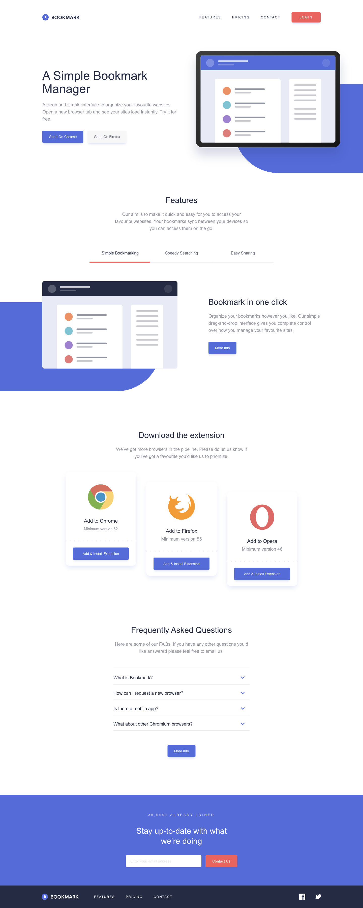

# Frontend Mentor - Bookmark landing page solution

This is a solution to the [Bookmark landing page challenge on Frontend Mentor](https://www.frontendmentor.io/challenges/bookmark-landing-page-5d0b588a9edda32581d29158). Frontend Mentor challenges help you improve your coding skills by building realistic projects. 

## Table of contents

- [Overview](#overview)
  - [The challenge](#the-challenge)
  - [Screenshot](#screenshot)
  - [Links](#links)
- [My process](#my-process)
  - [Built with](#built-with)
  - [What I learned](#what-i-learned)
  - [Continued development](#continued-development)
  - [Useful resources](#useful-resources)
- [Author](#author)
- [Acknowledgments](#acknowledgments)

## Overview

### The challenge

Users should be able to:

- View the optimal layout for the site depending on their device's screen size
- See hover states for all interactive elements on the page
- Receive an error message when the newsletter form is submitted if:
  - The input field is empty
  - The email address is not formatted correctly

### Screenshot

### Links

- Solution URL: [https://0x41-li.github.io/bookmark-landing-page/](https://0x41-li.github.io/bookmark-landing-page/)
- Live Site URL: [https://github.com/0x41-li/bookmark-landing-page](https://github.com/0x41-li/bookmark-landing-page)

## My process

### Built with

- Semantic HTML5 markup
- CSS custom properties
- Flexbox
- CSS Grid
- Mobile-first workflow
- [React](https://reactjs.org/) - JS library
- [MUI](https://mui.com/) - React UI Library 

### What I learned
- I learned MUI, and how to customize it to match you provided brand's design system.
- How to customize components, theme, and the whole workflow of working with such UI Library.

## Author

- Frontend Mentor - [@0x41-li](https://www.frontendmentor.io/profile/0x41-li)
- Twitter - [@AliSbane2](https://www.twitter.com/AliSbane2)